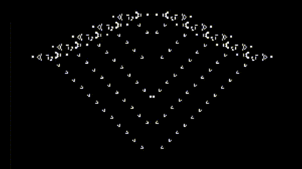
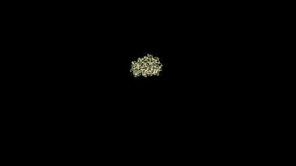

# Cellular Automata

## Synopsis

The purpose of this project is:
- to provide an easily reusable interface for creating videos from a series of 2D-vectors describing each frame
- to adapt such an interface with the goal of simulating discrete bidimentional cellular automata on rectangular or torus grids
- to implement specific such automata

## Preview


Brian's brain



Game of life


Abelian sandpile



Langton's ant


## How to build and run

- make sure that `ffmpeg` is installed
- edit main to choose automata and setup (it will eventually be possible to load a configuration file to avoid this step)
- compile and run with cargo: `cargo run --release` (`release` mode is recommended since the time lost optimizing is easily compensated during the execution, see NOTE #1)
- open the resulting `.avi` video

The front page of [LifeWiki](https://www.conwaylife.com/wiki) contains a collection of patterns. It is recommended to download the archive and extract it into `data/*` or `data/patterns/*`.
This will give you access to 15.6MB of patterns, from which 1446 `*.cells` and 2381 `*.rle` can be read by this project.


## Work in progress and future improvements

Work is currently in progress on:
- Abelian sandpiles (https://en.wikipedia.org/wiki/Abelian_sandpile_model)
- Conway's game of life and any other life-like automata (https://en.wikipedia.org/wiki/Life-like_cellular_automaton)
- Brian's brain (https://en.wikipedia.org/wiki/Brian%27s_Brain)
- Langton's ant (https://en.wikipedia.org/wiki/Langton%27s_ant)


TODO:
- enable reading from text files to initialize grid (beta available for game of life)
- create scanner to load a screenshot of a game of life state into an initializer (beta available in `lifescan/`)


It should be noted that this project relies heavily on `ffmpeg`. Luckily `ffmpeg` is available for all OS, but the commands may need tweaks to execute properly on non-Linux distributions.


## NOTE #1: About runtime vs compile-time

We first compare build times:

```
$ cargo clean -p cellular_automata
$ cargo build
min/max/avg5 of 7 : 0.54/0.62/0.56
```
```
$ cargo clean --release -p cellular_automata
$ cargo build --release
min/max/avg5 of 7 : 1.93/2.00/1.97
```

Compiling in `dev` rather that `release` can spare us a bit over a second.

But what of runtime ?

Both builds were run with the following configuration:
- Lifelike(23/3) rules
- a 200x300 field
- a single bricklayer loaded at the top right corner (`data/patterns/bricklayer.rle`)
- 5000 generations

The results speak for themselves:
```
dev:       12m28s    (incl. 45s running ffmpeg)
release:    1m29s    (incl. 45s running ffmpeg)
```
Thus this project should always be run with `cargo run --release`.
